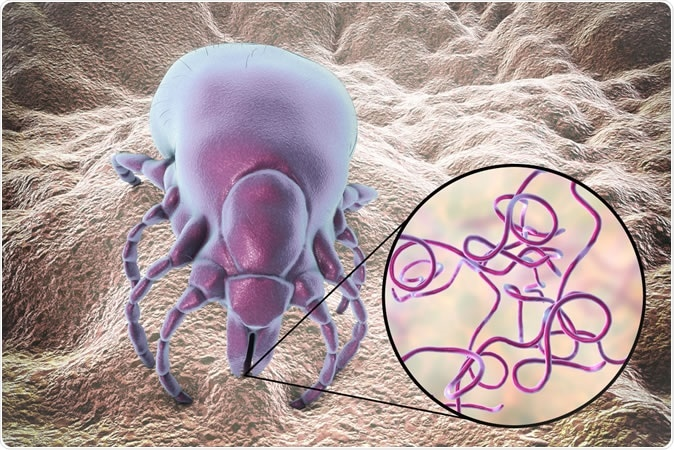

```{r setup, include=FALSE}
knitr::opts_chunk$set(echo = TRUE)
library(dplyr)  #load required packages
```

```{r}
sequence <- read.csv("Sequences.csv")  #load data
```


```{r}
counter <- 1  #counter for indicating the sequence variant 
countA <- 0 # initialising counter for A 
countC <- 0  # initialising counter for C
countG <- 0   # initialising counter for G
countT <- 0  # initialising counter for T
for (i in sequence[,3]){     #iterating over the 3 variants
  spl <- strsplit(i, split = "")  #split the sequence to iterate over
  for (k in 1:length(spl[[1]])){   #iterate overeach character
      if (spl[[1]][k] == "A"){
        countA <- countA + 1
      }
      if (spl[[1]][k] == "C"){
        countC <- countC + 1
      }
      if (spl[[1]][k] == "G"){
        countG <- countG + 1
      }
      if (spl[[1]][k] == "T"){
        countT <- countT + 1
      }
    
  }
  print(paste("The number of Adenine nucleotides in sequence", counter, "is", countA))      #paste to show the amount of A,C,G,T's
  print(paste("The number of Cytosine nucleotides in sequence", counter, "is", countC))
  print(paste("The number of Guanine nucleotides in sequence", counter, "is", countG))
  print(paste("The number of Thymine nucleotides in sequence", counter, "is", countT))
  
  countA <- 0  #set the counters back to 0 at the begining of the next sequence variant
  countC <- 0
  countG <- 0
  countT <- 0
  counter <- counter + 1 
}

```
```{r}
TableSeq <- c(154, 82, 131, 114, 155, 81, 131, 114, 154, 81, 131, 115)   #values of ACTG for tables
NucleotideNumb <- matrix(TableSeq, ncol = 4, byrow = TRUE)     #create table of data
colnames(NucleotideNumb) <- c("A", "C", "G", "T") #column names
rownames(NucleotideNumb) <- c("HQ433694.1", "HQ433692.1", "HQ433691.1")   #rownames of each variant
NucleotideNumb <- as.table(NucleotideNumb)
print(NucleotideNumb)
```


A general description of the bacteria can be [Further explored](https://en.wikipedia.org/wiki/Borrelia_burgdorferi#:~:text=Borrelia%20burgdorferi%20is%20a%20bacterial,known%20to%20cause%20the%20disease)




```{r}
GCSeq1 <- round(((NucleotideNumb[1,2] + NucleotideNumb[1,3])/sum(NucleotideNumb[1,]))*100, digits = 1)  #calculate the GC%
GCSeq2 <- round(((NucleotideNumb[2,2] + NucleotideNumb[2,3])/sum(NucleotideNumb[2,]))*100, digits = 1) #calculate the GC%
GCSeq3 <- round(((NucleotideNumb[3,2] + NucleotideNumb[3,3])/sum(NucleotideNumb[3,]))*100, digits = 1) #calculate the GC%
GCSeq1 <- print(paste(GCSeq1,"%")) #add % 
GCSeq2 <- print(paste(GCSeq2,"%"))#add % 
GCSeq3 <- print(paste(GCSeq3,"%"))#add % 

TableContents <- c("HQ433694.1", GCSeq1, "HQ433692.1",GCSeq2,"HQ433691.1", GCSeq3 ) #create data to input into table
FinalTable <- matrix(TableContents, ncol = 2, byrow = TRUE)  #create table
colnames(FinalTable) <- c("Sequence IDs", "GC Content") #create column names 
FinalTable
```

To find my [GitHub account](https://github.com/alexrow15/Rentrez) to my Rentrez repository


